# Lab P4 - BluePrints in Real Time (Sockets & STOMP)

> **Main repository:** [TerraFour-ECI/arsw-blueprints-api-realtime-sockets-lab](https://github.com/TerraFour-ECI/arsw-blueprints-api-realtime-sockets-lab)

<div align="center">


### End-to-end flow: login, token handoff, secured CRUD, and live realtime drawing.

</div>

---

## 📄 Laboratory Report

The comprehensive formal documentation for this laboratory—detailing the dual realtime architecture, JWT socket hardening, test strategies, and conclusions—can be found in the generated PDF report:

👉 **[View Full Lab 7 Report (PDF)](./report/main.pdf)**

---

## 🎯 Objective

Implement realtime collaboration for BluePrints while keeping secured CRUD integration and demonstrating protocol interoperability with **Socket.IO** and **STOMP**.

At the end, the system should:
1. Authenticate users with JWT.
2. Open the realtime UI through authenticated handoff.
3. Execute CRUD operations against secured API.
4. Replicate drawing events in near real time across tabs.

---

## 🧭 Repositories Used in This Lab

- **JWT frontend (login/handoff):** [TerraFour-ECI/arsw-blueprints-api-react-lab](https://github.com/TerraFour-ECI/arsw-blueprints-api-react-lab)
- **Security backend (JWT + secured CRUD):** [TerraFour-ECI/arsw-blueprints-api-security-lab](https://github.com/TerraFour-ECI/arsw-blueprints-api-security-lab)
- **Realtime frontend (this repo):** [TerraFour-ECI/arsw-blueprints-api-realtime-sockets-lab](https://github.com/TerraFour-ECI/arsw-blueprints-api-realtime-sockets-lab)
- **Socket.IO backend:** [TerraFour-ECI/blueprints-example-backend-socketio-node](https://github.com/TerraFour-ECI/blueprints-example-backend-socketio-node)
- **STOMP backend:** [TerraFour-ECI/blueprints-example-backend-stomp](https://github.com/TerraFour-ECI/blueprints-example-backend-stomp)

---

## 🌐 Port and Responsibility Map

| Component | Repository | Local URL | Responsibility |
|---|---|---|---|
| JWT Frontend | `arsw-blueprints-api-react-lab` | `http://localhost:5173` | Login and token generation |
| Security API | `arsw-blueprints-api-security-lab` | `http://localhost:8080` | Secured CRUD + JWT validation |
| Realtime Frontend | `arsw-blueprints-api-realtime-sockets-lab` | `http://localhost:5174` | Canvas, CRUD actions, RT selector |
| Socket.IO Backend | `blueprints-example-backend-socketio-node` | `http://localhost:3001` | Room-based realtime events |
| STOMP Backend | `blueprints-example-backend-stomp` | `http://localhost:8081` (integrated flow) | Topic-based realtime events |

> Note: STOMP backend may run on `8080` by default in isolation, but this integrated flow uses `8081` to avoid conflict with security API on `8080`.

---

## 🏗️ Architecture (Advanced Mermaid)

```mermaid
flowchart LR
    subgraph A[Client Apps]
      JWTUI[JWT Frontend\narsw-blueprints-api-react-lab\n:5173]
      RTUI[Realtime Frontend\narsw-blueprints-api-realtime-sockets-lab\n:5174]
    end

    subgraph B[Core API]
      SEC[Security Backend\narsw-blueprints-api-security-lab\n:8080]
    end

    subgraph C[Realtime Backends]
      IO[Socket.IO Backend\nblueprints-example-backend-socketio-node\n:3001]
      ST[STOMP Backend\nblueprints-example-backend-stomp\n:8081 integrated]
    end

    JWTUI -->|1. Login + JWT issue| SEC
    JWTUI -->|2. Token handoff (query param)| RTUI
    RTUI -->|3. Authenticated CRUD\nGET/POST/PUT/DELETE| SEC
    RTUI -->|4A. join-room/draw-event| IO
    IO -->|5A. blueprint-update| RTUI
    RTUI -->|4B. SEND /app/draw| ST
    ST -->|5B. MESSAGE /topic/blueprints.author.name| RTUI

    classDef ui fill:#e0f2fe,stroke:#0284c7,stroke-width:2px,color:#0c4a6e;
    classDef api fill:#ecfccb,stroke:#65a30d,stroke-width:2px,color:#365314;
    classDef rt fill:#fee2e2,stroke:#dc2626,stroke-width:2px,color:#7f1d1d;
    class JWTUI,RTUI ui;
    class SEC api;
    class IO,ST rt;
```

**Conventions**
- Blueprint channel/room: `blueprints.{author}.{name}`
- Draw payload: `{ x, y }`

---

## 🧩 Functional Scope

- **CRUD (secured):**
  - `GET /api/blueprints?author=:author`
  - `GET /api/blueprints/:author/:name`
  - `POST /api/blueprints`
  - `PUT /api/blueprints/:author/:name` and/or point persistence endpoint in your secured API contract
  - `DELETE /api/blueprints/:author/:name`
- **Realtime:**
  - Socket.IO mode: `join-room`, `draw-event`, `blueprint-update`
  - STOMP mode: publish `/app/draw`, subscribe `/topic/blueprints.{author}.{name}`
- **UI:**
  - Click-to-draw canvas
  - Author table + total points
  - Actions: Create / Save-Update / Delete
  - Realtime selector: None / Socket.IO / STOMP

---

## 🛠️ How It Was Implemented (Traceability)

### Frontend realtime implementation (this repo)
- Transport switching and realtime subscriptions are handled in `src/App.jsx`.
- Socket.IO client is configured with forced WebSocket transport in `src/lib/socketIoClient.js`.
- STOMP client includes reconnect and heartbeat configuration in `src/lib/stompClient.js`.
- Secured CRUD calls with JWT auth headers and payload normalization are implemented in `src/services/blueprintsApi.js`.

### Security and auth flow implementation
- JWT generation/login UI and handoff start from `arsw-blueprints-api-react-lab` (`:5173`).
- Secured CRUD endpoints and JWT validation run in `arsw-blueprints-api-security-lab` (`:8080`).

### Realtime backend implementation
- Socket.IO events (`join-room`, `draw-event`, `blueprint-update`) are implemented in `blueprints-example-backend-socketio-node/server.js`.
- STOMP contracts (`/ws-blueprints`, `/app/draw`, `/topic/blueprints.{author}.{name}`) are implemented in `blueprints-example-backend-stomp`.

---

## ⚙️ Environment Variables (This Realtime Frontend)

Create `.env.local` in this repo:

```bash
VITE_API_BASE=http://localhost:8080
VITE_IO_BASE=http://localhost:3001
VITE_STOMP_BASE=http://localhost:8081
```

---

## 🚀 Sequential Startup (Recommended)

1. Start **security backend** (`8080`) from [arsw-blueprints-api-security-lab](https://github.com/TerraFour-ECI/arsw-blueprints-api-security-lab).
2. Start **JWT frontend** (`5173`) from [arsw-blueprints-api-react-lab](https://github.com/TerraFour-ECI/arsw-blueprints-api-react-lab).
3. Start **one realtime backend**:
   - Socket.IO backend (`3001`) from [blueprints-example-backend-socketio-node](https://github.com/TerraFour-ECI/blueprints-example-backend-socketio-node), or
   - STOMP backend (`8081`) from [blueprints-example-backend-stomp](https://github.com/TerraFour-ECI/blueprints-example-backend-stomp).
4. Start this **realtime frontend** (`5174`):

```bash
npm i
npm run dev
```

5. Login on `5173`, open **Realtime Lab**, then test in 2 tabs using the same author and blueprint.

---

## 🔌 Realtime Protocol Snippets

### Socket.IO

```js
socket.emit('join-room', `blueprints.${author}.${name}`)
socket.emit('draw-event', { room, author, name, point: { x, y } })
socket.on('blueprint-update', (upd) => { /* append points and repaint */ })
```

### STOMP

```js
client.publish({ destination: '/app/draw', body: JSON.stringify({ author, name, point }) })
client.subscribe(`/topic/blueprints.${author}.${name}`, (msg) => { /* append points and repaint */ })
```

---

## 🎬 Demo Video

- [demo-blueprints-realtime-socketio-stomp.mp4](demo-blueprints-realtime-socketio-stomp.mp4)

### 📽️ What the demo shows (<= 90s)

1. User logs in from `:5173` and obtains JWT.
2. User opens Realtime Lab on `:5174` with token handoff.
3. Author + blueprint are loaded from secured API on `:8080`.
4. Create, Save/Update, and Delete operations are executed successfully.
5. Two-tab collaboration is demonstrated with Socket.IO (`:3001`).
6. Two-tab collaboration is demonstrated with STOMP (`:8081`).
7. Final evidence shows lint, test, coverage, and build passing.

### 🎥 Evidence mapping from video to requirements
- Authentication + secure handoff: covered in steps 1-2.
- CRUD operational: covered in steps 3-4.
- Realtime stability and isolation by blueprint: covered in steps 5-6.
- Technical quality and reproducibility: covered in step 7.

---

## 📸 Evidence Gallery

### 00 - JWT login success
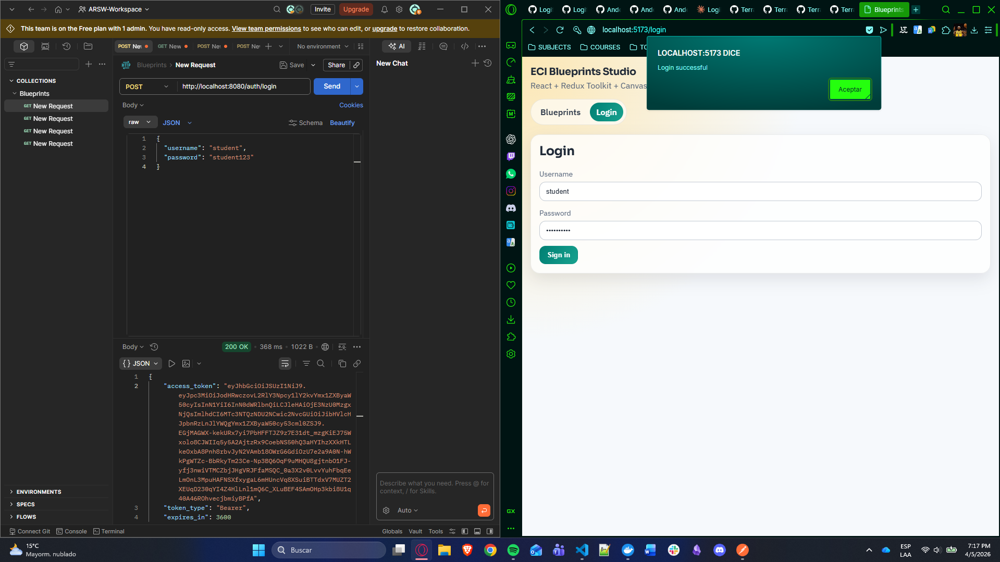

### 01 - Realtime handoff link
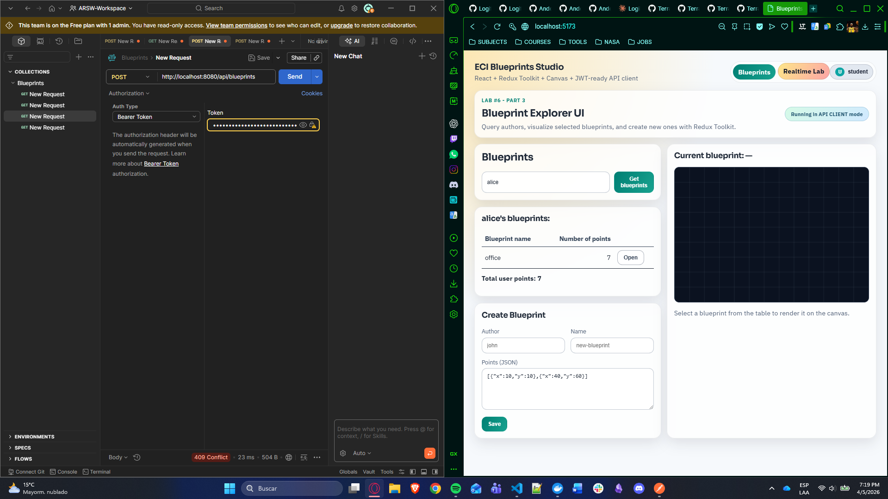

### 02 - Realtime home overview
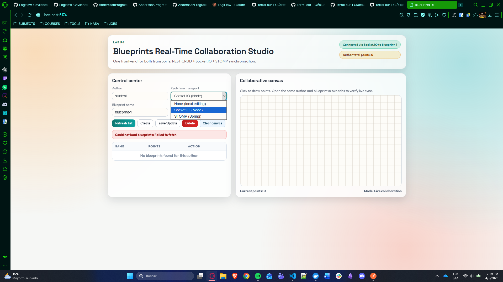

### 03 - Author list loaded
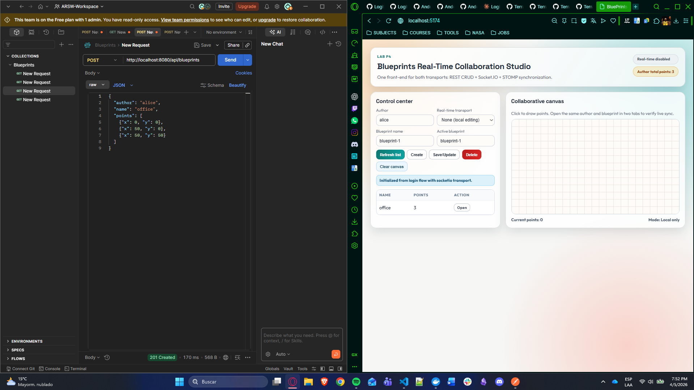

### 04 - Blueprint opened
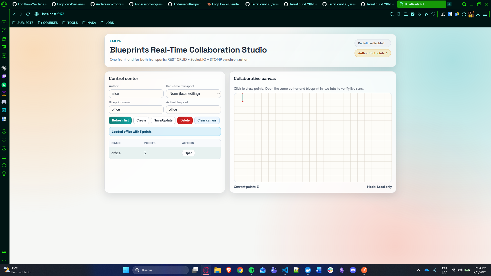

### 05 - Socket.IO synchronization
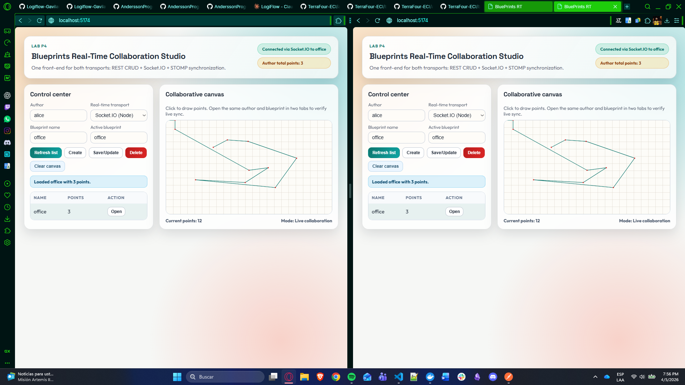

### 06 - STOMP synchronization
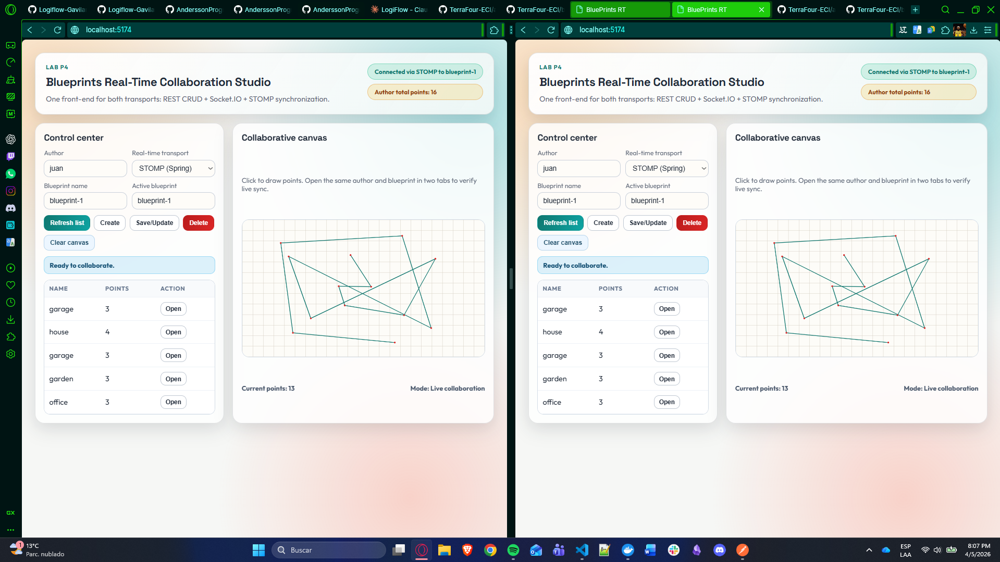

### 07 - Create success
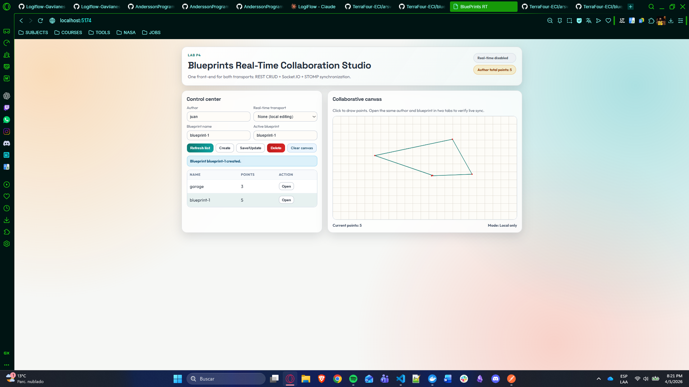

### 08 - Save/Update success
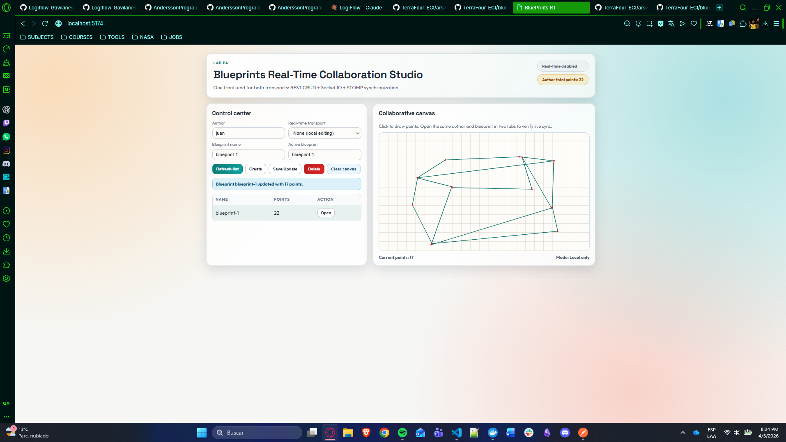

### 09 - Delete success
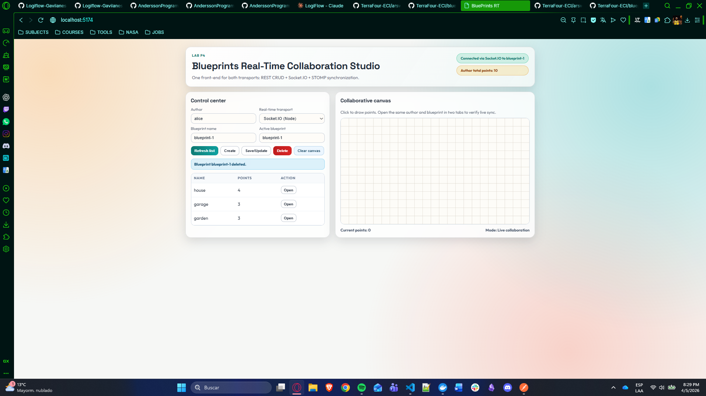

### 10 - Quality commands pass
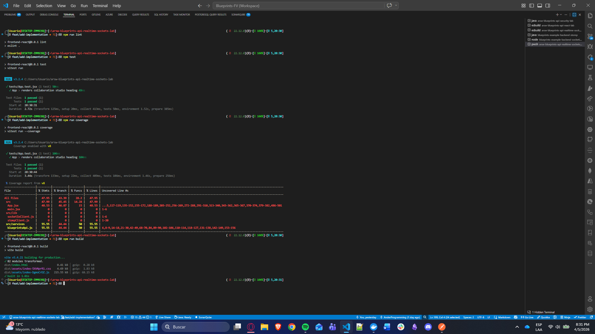

---

## ✅ Quality Commands

```bash
npm run lint
npm run test
npm run coverage
npm run build
```

---

## 📊 Team Deliverables

- ✅ Frontend code integrated with CRUD and realtime transport (Socket.IO and STOMP modes available).
- ✅ Short demo video (<= 90s) showing live collaboration and CRUD operations.
- ✅ Team README with setup, used endpoints, room/topic decisions, and integration details.

---

## 🧮 Suggested Grading Rubric Coverage

- **Functionality (40%)**: stable RT join/broadcast, blueprint isolation by room/topic, secured CRUD operational.
- **Technical Quality (30%)**: clean structure, explicit error handling, clear and complete documentation.
- **Observability/DX (15%)**: event and connection logs in realtime backends, reproducible startup flow, quick endpoint checks.
- **Analysis (15%)**: protocol comparison and practical findings on latency/reconnection behavior.

### ✅ Rubric readiness check
- Functionality: implemented and evidenced.
- Technical quality: implemented and documented with architecture + startup + troubleshooting.
- Observability/DX: implemented with backend logs and health endpoints.
- Analysis: included as practical protocol comparison and deployment notes.

---

## 🔬 Security Test Evidence (Automated)

To strengthen review confidence, realtime authorization is also validated with automated tests:

- **Socket.IO backend tests** (`npm test` in `blueprints-example-backend-socketio-node`):
  - valid JWT accepted,
  - invalid JWT rejected,
  - foreign-author room access rejected.
- **STOMP backend tests** (`mvn clean test` in `blueprints-example-backend-stomp`):
  - CONNECT token validation,
  - subscription authorization by topic/author,
  - publish authorization using authenticated principal.

---

## 🔐 Security Minimums

- Payload validation for draw events and CRUD inputs (recommended via zod/joi or backend validators).
- Restricted CORS origins in production.
- JWT authentication integrated in the end-to-end flow.
- Optional enhancement: authorization by blueprint room/topic ownership.

### Current implementation status
- Socket.IO backend: draw payload validation + CORS env configuration + `/health` endpoint + JWT handshake authorization + room ownership checks.
- STOMP backend: draw payload validation + configurable allowed origins + JWT authorization on CONNECT/SUBSCRIBE + principal-based author enforcement on draw publish.
- Frontend realtime: JWT token handoff and Bearer token propagation for secured CRUD plus RT handshakes (Socket.IO auth and STOMP connect headers).

---

## 📈 Analysis Notes (Socket.IO vs STOMP)

- **Socket.IO**: simpler event model for frontend teams and fast setup in Node ecosystems.
- **STOMP**: explicit destination model (`/app`, `/topic`) fits Spring broker architecture.
- **Observed in this lab**: both protocols satisfy live-collaboration requirements when room/topic naming is consistent and subscriptions are aligned.

---

## 🩺 Troubleshooting

- If realtime app cannot fetch data, verify `VITE_API_BASE=http://localhost:8080` and security backend is running.
- If Socket.IO does not replicate, verify room name and `VITE_IO_BASE=http://localhost:3001`.
- If STOMP does not replicate, verify `/ws-blueprints`, `/app`, `/topic`, and `VITE_STOMP_BASE=http://localhost:8081`.
- If JWT flow fails, verify login app on `5173`, token handoff query param, and accepted CORS origins.

---

## 📄 License

MIT [LICENSE](LICENSE)
