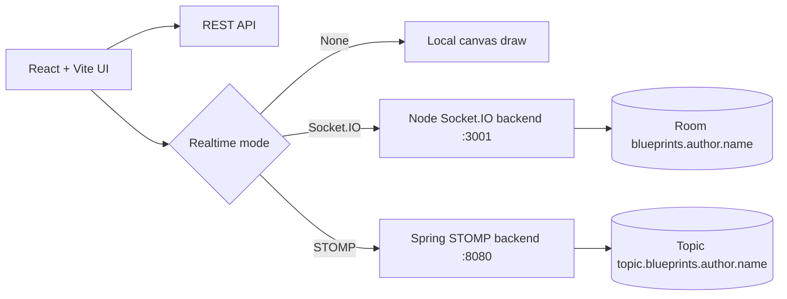
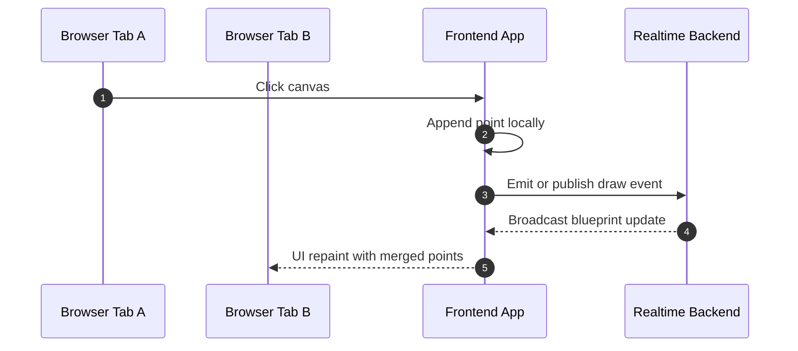

# BluePrints RT Lab P4 - Ultimate Dual-Transport Collaboration Guide

<div align="center">


### Build once, collaborate twice: REST CRUD + Socket.IO + STOMP in one polished front-end.

</div>

---

## Table of contents

- [Overview](#overview)
- [Lab goals](#lab-goals)
- [Feature checklist](#feature-checklist)
- [Architecture](#architecture)
- [API contracts](#api-contracts)
- [Environment setup](#environment-setup)
- [Run instructions](#run-instructions)
- [Validation commands](#validation-commands)
- [Screenshot evidence kit](#screenshot-evidence-kit)
- [Demo script](#demo-script)
- [Project structure](#project-structure)

---

## Overview

This repository is the front-end implementation for P4 BluePrints real-time collaboration.
It combines:

- **Part 3 CRUD API integration**
- **Socket.IO live synchronization (Node backend)**
- **STOMP live synchronization (Spring backend)**
- **author-scoped blueprint rooms/topics**
- **clean, responsive, demo-ready UI**

---

## Lab goals

1. Load and manage blueprints through REST.
2. Draw points on canvas incrementally.
3. Synchronize drawing in real time across multiple tabs.
4. Support both realtime backends through a transport selector.
5. Keep code quality and CI verification reproducible.

---

## Feature checklist

### CRUD (REST)

- `GET /api/blueprints?author=:author`
- `GET /api/blueprints/:author/:name`
- `POST /api/blueprints`
- `PUT /api/blueprints/:author/:name`
- `DELETE /api/blueprints/:author/:name`

### Realtime

- **Socket.IO**: room join + point broadcast (`join-room`, `draw-event`, `blueprint-update`)
- **STOMP**: publish + topic subscription (`/app/draw`, `/topic/blueprints.{author}.{name}`)
- **Mode switch**: None / Socket.IO / STOMP

---

## Architecture



### Draw synchronization sequence



---

## API contracts

### Room/topic naming convention

- `blueprints.{author}.{name}`

### Point payload

```json
{ "x": 120, "y": 90 }
```

### Realtime update payload

```json
{
  "author": "juan",
  "name": "blueprint-1",
  "points": [{ "x": 120, "y": 90 }]
}
```

---

## Environment setup

Create `.env.local`:

```bash
VITE_API_BASE=http://localhost:8080
VITE_IO_BASE=http://localhost:3001
VITE_STOMP_BASE=http://localhost:8080
```

---

## Run instructions

### 1) Start realtime backends

- Socket.IO backend:
  https://github.com/TerraFour-ECI/blueprints-example-backend-socketio-node
- STOMP backend:
  https://github.com/TerraFour-ECI/blueprints-example-backend-stomp

### 2) Start this front-end

```bash
npm install
npm run dev
```

Open:

- `http://localhost:5173`

---

## Validation commands

```bash
npm run lint
npm run test
npm run coverage
npm run build
```

---

## Screenshot evidence kit

Create an `images/` directory and add the following high-value captures:

| File name | What to capture |
|---|---|
| `01-home-overview.png` | Full page: control panel + realtime selector + canvas |
| `02-author-list-loaded.png` | Author query with blueprint list and total points |
| `03-open-blueprint.png` | Selecting one blueprint and rendering canvas points |
| `04-socketio-sync-tabA-tabB.png` | Two tabs showing Socket.IO replication |
| `05-stomp-sync-tabA-tabB.png` | Two tabs showing STOMP replication |
| `06-create-blueprint-success.png` | Create action success message |
| `07-save-update-success.png` | Save/Update action with changed point count |
| `08-delete-blueprint-success.png` | Delete action and list refresh |
| `09-quality-commands-pass.png` | Terminal output: lint, test, coverage, build |
| `10-sonar-workflow-pass.png` | GitHub Actions + SonarCloud green checks |

### Optional gallery block

```md
## Evidence Gallery


```

---

## Demo script

1. Open two tabs with same author and blueprint.
2. Draw with Socket.IO mode and show instant replication.
3. Switch to STOMP mode and repeat replication.
4. Create new blueprint, add points, save update.
5. Delete blueprint and verify list refresh.
6. Show passing quality commands in terminal.

---

## Project structure

```text
src/
  App.jsx
  main.jsx
  styles.css
  lib/
    socketIoClient.js
    stompClient.js
  services/
    blueprintsApi.js
tests/
  App.test.jsx
  setup.js
eslint.config.js
vitest.config.js
```

---

## License

MIT [LICENSE](LICENSE)
