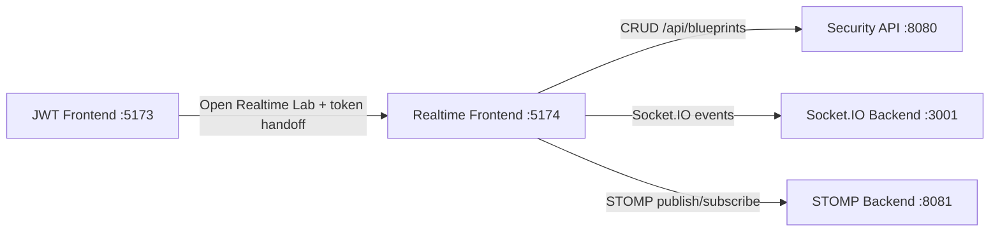

# 🚀 BluePrints RT Lab P4 - Final Showcase (JWT + Socket.IO + STOMP)

<div align="center">


### 🎯 One integrated flow: Login first, then collaborative realtime drawing with two transport protocols.

</div>

---

## ✨ What this repository delivers

This project is the **Part 4 frontend** for BluePrints realtime collaboration, integrated with:

- 🔐 **JWT-secured API** (login-first flow from port `5173`)
- 🧩 **REST CRUD** operations against the secured backend (`8080`)
- ⚡ **Socket.IO** realtime collaboration (`3001`)
- 📡 **STOMP/WebSocket** realtime collaboration (`8081`)
- 🖼️ polished interface + evidence-ready workflow

---

## 🧭 Final architecture



---

## 🔐 Environment setup

Create `.env.local` in this repo:

```bash
VITE_API_BASE=http://localhost:8080
VITE_IO_BASE=http://localhost:3001
VITE_STOMP_BASE=http://localhost:8081
```

---

## ▶️ Run flow

1. Start security backend on `8080`.
2. Start JWT frontend (`arsw-blueprints-api-react-lab`) on `5173`.
3. Login and click **Realtime Lab** in the navbar.
4. Realtime app opens on `5174` with author + JWT handoff.
5. Use Socket.IO or STOMP mode and verify collaboration.

---

## 🎬 Demo video

- **Watch full lab demo:** [demo-blueprints-realtime-socketio-stomp.mp4](demo-blueprints-realtime-socketio-stomp.mp4)

---

## 📸 Evidence gallery (real captures)

### 00 - JWT login success
Shows the successful authentication screen before opening realtime.


### 01 - Handoff link visible after login
Shows the **Realtime Lab** access point from the authenticated app.


### 02 - Realtime home overview
Main dashboard with control panel + transport selector + canvas.


### 03 - Author list loaded
Author query resolved and blueprint list displayed with point totals.


### 04 - Blueprint opened in canvas
Selected blueprint rendered in canvas with current point count.


### 05 - Socket.IO realtime replication
Two-tab collaboration evidence using Socket.IO transport.


### 06 - STOMP realtime replication
Two-tab collaboration evidence using STOMP transport.


### 07 - Blueprint creation success
Successful `Create` operation in secured CRUD flow.


### 08 - Save/Update success
Successful point persistence (`PUT /points`) with updated totals.


### 09 - Delete success
Successful deletion from secured backend and refreshed list.


### 10 - Quality commands pass
Local quality checks and build evidence.


---

## ✅ Quality commands

```bash
npm run lint
npm run test
npm run coverage
npm run build
```

---

## 📂 Project map

```text
src/
  App.jsx
  main.jsx
  styles.css
  lib/
    socketIoClient.js
    stompClient.js
  services/
    blueprintsApi.js
tests/
  App.test.jsx
  setup.js
eslint.config.js
vitest.config.js
```

---

## 📄 License

MIT [LICENSE](LICENSE)
