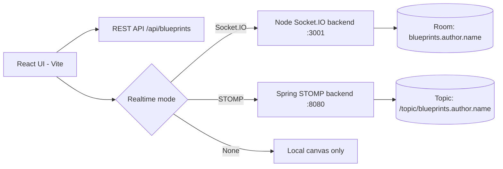
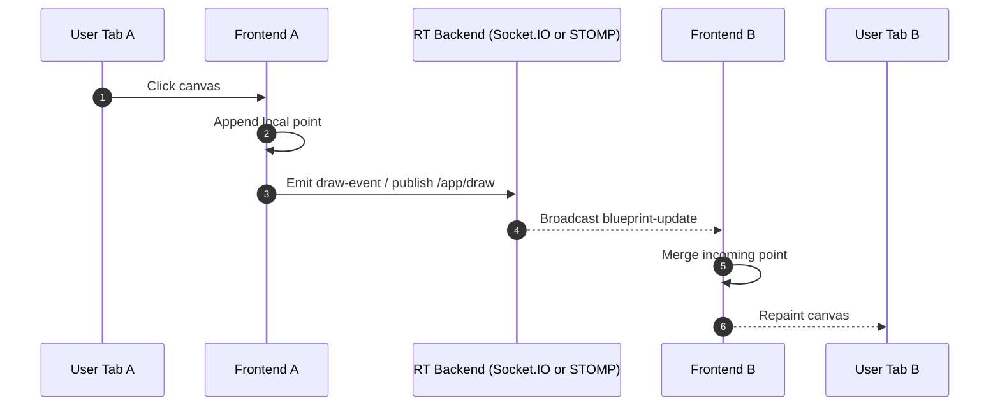

# BluePrints RT Lab P4 - Dual Transport Collaboration Studio

<div align="center">


A production-style laboratory front-end that combines **REST CRUD** with **real-time collaboration** using **both transports**:
**Socket.IO (Node.js)** and **STOMP (Spring Boot)**.

</div>

---

## Why this repository matters

This lab implements all P4 objectives over a polished, testable, and CI-ready React codebase:

- Full BluePrints CRUD integration (`GET/POST/PUT/DELETE`).
- Real-time sync selector with three modes: `None`, `Socket.IO`, `STOMP`.
- Live canvas collaboration by room/topic: `blueprints.{author}.{name}`.
- Author dashboard with blueprint table + point totals.
- Lint, tests, coverage, and build scripts aligned with SonarCloud workflow.

---

## Quick architecture



### Runtime sequence (draw event)



---

## Functional scope delivered

- **CRUD REST**
  - `GET /api/blueprints?author=:author`
  - `GET /api/blueprints/:author/:name`
  - `POST /api/blueprints`
  - `PUT /api/blueprints/:author/:name`
  - `DELETE /api/blueprints/:author/:name`
- **Real-time**
  - `Socket.IO`: `join-room`, `draw-event`, `blueprint-update`
  - `STOMP`: `/app/draw`, `/topic/blueprints.{author}.{name}`
- **UI**
  - Click-to-draw canvas
  - Blueprint list by author
  - Running total of points by author
  - Create / Save-Update / Delete actions
  - Transport selector: None / Socket.IO / STOMP

---

## Environment setup

Create `.env.local`:

```bash
# CRUD API (Part 3 backend or equivalent)
VITE_API_BASE=http://localhost:8080

# Socket.IO backend (Node guide backend)
VITE_IO_BASE=http://localhost:3001

# STOMP backend (Spring guide backend)
VITE_STOMP_BASE=http://localhost:8080
```

---

## Run guide

### 1) Start one or both realtime backends

- Socket.IO backend reference:
  https://github.com/TerraFour-ECI/blueprints-example-backend-socketio-node
- STOMP backend reference:
  https://github.com/TerraFour-ECI/blueprints-example-backend-stomp

### 2) Start this front-end

```bash
npm install
npm run dev
```

Open: `http://localhost:5173`

---

## Quality and CI commands

```bash
npm run lint
npm run test
npm run coverage
npm run build
```

These commands are aligned with the GitHub Actions + SonarCloud pipeline in `.github/workflows/sonarcloud.yml`.

---

## Screenshot evidence plan (recommended)

Create an `images/` folder and capture these screenshots:

1. **01-dashboard-overview.png**
   - Full UI with author panel, realtime selector, and canvas.
2. **02-socketio-live-sync.png**
   - Two tabs open with `Socket.IO`, drawing replicated.
3. **03-stomp-live-sync.png**
   - Two tabs open with `STOMP`, drawing replicated.
4. **04-crud-create-and-list.png**
   - Create action and updated table with point totals.
5. **05-save-update-points.png**
   - Added points + Save/Update success feedback.
6. **06-delete-blueprint.png**
   - Before/after delete evidence.
7. **07-ci-local-validation.png**
   - Terminal with lint, test, coverage, build all passing.

Example embed block:

```md
## Evidence


```

---

## Suggested demo script (<= 90s)

1. Open front-end in two tabs.
2. Load same author + blueprint in both tabs.
3. Switch to `Socket.IO`, draw in tab A, show replication in tab B.
4. Switch to `STOMP`, repeat replication.
5. Perform `Create`, `Save/Update`, and `Delete`.
6. Show terminal with `npm run lint && npm run test && npm run coverage && npm run build`.

---

## Repository structure

```text
src/
  App.jsx
  main.jsx
  styles.css
  lib/
    socketIoClient.js
    stompClient.js
  services/
    blueprintsApi.js
tests/
  App.test.jsx
  setup.js
eslint.config.js
vitest.config.js
```

---

## License

MIT (or your course/team license policy).
